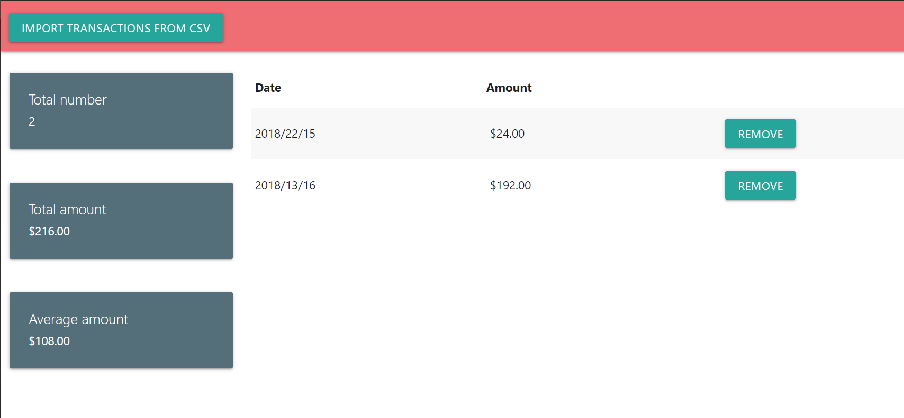

# `Task description`

## Implement self-contained application
The application should include:
- Angular for frontend;
- Node:10 for backend(express.js);
- MongoDB for data storage.

### Frontend
Frontend side of the application should allow users to upload CSV files with transactions list.

Expect the following file structure:

| id        | cardHolderHash | datetime | amount |
| --------- | -------------- | -------- | -----: |
| 1   | 3ddldnbiej3355Ed | 2018-08-15 10:22:23 GMT+0300 | 24.0 |
| 2   | fdsvnseres3435fn | 2018-08-16 11:13:43 GMT+0300 | 192.0 |

After uploading a new file all of the transaction data should be shown on the page without refreshing it. Use table view here with schema as described for CSV file.
The page should include all transactions uploaded previously (all the uploads should be stored in MongoDB).
For each transaction user should have an ability to delete it from the website.

Implement two additional widgets: amount of all transactions and average amount.

### Backend
Should include REST API for transactions and additional endpoint for CSV file uploading.

Use express.js as a backend framework.

### MongoDB
Should store transactions data.

### Additional info
The requirements are incomplete, you are allowed to make any additional assumptions without approval (i.e. the size of the csv file, behavior if the user uploads a bad file, etc.). Yet you need to list all of those assumed preconditions in the readme.md file of your application.

# `Application description`
The application may save data about user's transactions and updated view according to interactions. It allows to import data from CSV file and remove any specific record. Moreover the app calculates some aggregation values.

## `User interface`

# `Technical details`
This project was based on following tools: Angular, NodeJs and MongoDB. Additionally such libraries as ExpressJs, Multer were integrated.

### `Setup`
+ The application uses MongoDB server, therefore it has to be installed on your machine. Instructions may be found [here](https://docs.mongodb.com/manual/installation/).
+ Run `npm run install-be-fe-dependecies` in order to setup all dependencies for the application
+ Run `npm run start-be-fe` to start both servers: Angular and NodeJs.

### `TODOs`
+ Cover functionality with unit-tests
+ Cover cases of mistakes (wrong file, incorrect data)
+ Review UI for better/nicer experience
+ Rewrite usage of MongoDB - from local to cloud (MongoDB Atlas)
+ Extend functionality with 
    - user authorization
    - update function for a transaction
